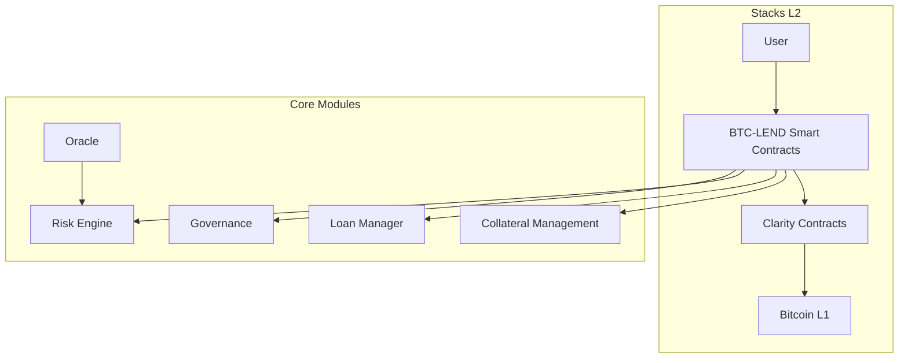

# **BTC-LEND: Bitcoin-Backed Lending Protocol**

[](https://www.stacks.co)
[](https://clarity-lang.org)

**BTC-LEND** is a decentralized, non-custodial lending protocol built on the Stacks Layer 2 for Bitcoin. It allows users to borrow assets by locking their BTC as collateral, while maintaining full control of their Bitcoin—no cross-chain bridges required.

---

## 🚀 Key Features

* **BTC as Collateral**: Trustless, non-custodial BTC vaults
* **Capital Efficiency**: 150% minimum collateral ratio, 120% liquidation threshold
* **Automated Liquidations**: Triggered by real-time collateral ratio monitoring
* **Clarity Smart Contracts**: Built natively on Stacks L2 for Bitcoin-native security
* **Transparent Governance**: On-chain governance for risk and protocol settings
* **Interest Accrual**: Dynamic rate model with base interest (5% annually)
* **Oracle Integration**: Secure price feeds for BTC and supported assets

---

## 🏗️ Protocol Architecture



---

## 🧩 Core Components

### 1. Collateral Management

* `deposit-collateral`: Lock BTC in protocol vaults
* Tracks `total-btc-locked`
* Enforces collateral ratio (≥ 150%)

### 2. Loan Manager

* `request-loan`, `repay-loan`
* Tracks loan lifecycle: active, repaid, liquidated
* Applies base interest rate (5%)

### 3. Risk Engine

* Monitors real-time collateral ratios
* Triggers `liquidate-position` at ≤ 120%
* Validates oracle prices

### 4. Governance

* `update-collateral-ratio`, `update-liquidation-threshold`
* Whitelist assets, control protocol parameters
* Emergency shutdowns & updates

### 5. Price Oracle

* Feeds BTC, STX, and future asset prices
* Must support redundancy and validation

---

## 📦 Supported Assets

```clojure
(define-constant VALID-ASSETS (list "BTC" "STX"))
```

Planned future support: USDC, sBTC, others.

---

## 📜 Smart Contract Interface

### 🔧 Core Functions

| Function             | Description                               | Parameters                  |
| -------------------- | ----------------------------------------- | --------------------------- |
| `deposit-collateral` | Lock BTC as collateral                    | `amount`                    |
| `request-loan`       | Borrow supported assets                   | `collateral`, `loan-amount` |
| `repay-loan`         | Repay loan and interest                   | `loan-id`, `amount`         |
| `liquidate-position` | Triggered if collateral ratio < threshold | `loan-id`                   |

### ⚙️ Governance

| Function                       | Description                     |
| ------------------------------ | ------------------------------- |
| `update-collateral-ratio`      | Adjust minimum collateral ratio |
| `update-liquidation-threshold` | Modify liquidation threshold    |
| `update-price-feed`            | Update asset price              |

### 📖 Queries

| Read Function        | Returns                                 |
| -------------------- | --------------------------------------- |
| `get-loan-details`   | Loan status, interest, collateral ratio |
| `get-user-loans`     | User’s active loans                     |
| `get-platform-stats` | TVL, loan count, risk settings          |

---

## 📈 Risk Parameters

| Parameter             | Default Value | Description                       |
| --------------------- | ------------- | --------------------------------- |
| Collateral Ratio      | 150%          | Minimum for loan creation         |
| Liquidation Threshold | 120%          | Triggers liquidation mechanism    |
| Platform Fee          | 1%            | Protocol cut from borrowed amount |
| Interest Rate (Base)  | 5% annual     | Borrowing cost accrued over time  |

---

## 🔄 Workflow

1. **Deposit Collateral**

   ```clarity
   (deposit-collateral amount)
   ```

   Locks BTC in non-custodial vaults.

2. **Request Loan**

   ```clarity
   (request-loan collateral loan-amount)
   ```

   Validates against minimum collateral ratio.

3. **Manage Position**

   * Auto-accruing interest
   * Manual repayments
   * Live collateral ratio tracking

4. **Liquidation Protection**

   * Triggered at ≤ 120% ratio
   * Future support for auction/liquidator incentives

---

## ⚠️ Error Handling

| Code                          | Meaning                       |
| ----------------------------- | ----------------------------- |
| `ERR-NOT-AUTHORIZED`          | Unauthorized function call    |
| `ERR-INSUFFICIENT-COLLATERAL` | Collateral < required         |
| `ERR-INVALID-AMOUNT`          | Incorrect amount specified    |
| `ERR-INVALID-PRICE`           | Malformed or stale price feed |

---

## 🔧 Development & Deployment

### Prerequisites

* Node.js (LTS)
* Clarinet CLI
  Install:

  ```bash
  npm install -g @hirosystems/clarinet
  ```

### Build & Test

```bash
clarinet check
clarinet test
```

### Deploy

1. Update `Clarinet.toml`
2. Deploy:

   ```bash
   clarinet deploy
   ```

---

## 📡 Event Monitoring

Track on-chain activity:

* `loan-created`
* `loan-repaid`
* `loan-liquidated`
* `collateral-updated`

---

## 🔐 Security Considerations

* **Clarity Language**: Predictable, non-Turing complete
* **BTC Vaults**: Must securely anchor to Bitcoin L1
* **Oracle Security**: Redundant price feeds required
* **Liquidation Safety**: Slippage & manipulation resistance
* **Future**: Add insurance fund, validator staking, multi-sig upgrades

---

## 🛣️ Roadmap

* [ ] Multi-asset collateral (e.g., STX, sBTC)
* [ ] Dynamic interest rate model
* [ ] Liquidator rewards & auto-bots
* [ ] Insurance fund for bad debt
* [ ] Full DAO governance

---

## ✅ Testing Requirements

1. Simulate collateral ratio edge cases
2. Oracle outage and manipulation scenarios
3. Interest accrual across block heights
4. Multi-loan management & repayment flows

---

## 🤝 Contributing

1. Fork repository
2. Create feature branch
3. Add tests with your changes
4. Submit PR with clear description
